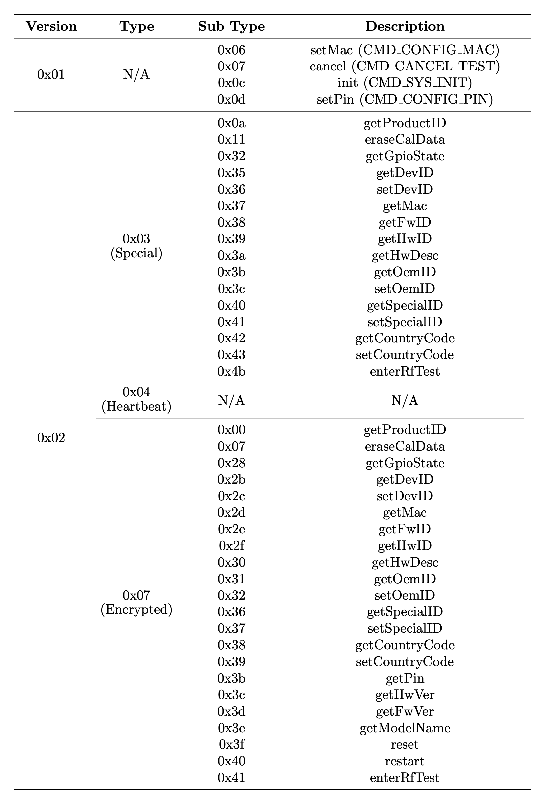

# TDDPClient

***It is important to note TDDP‘s behavior on different firmware versions or router models may differ in several features.***

## Definition of TDDP

* **TP-Link Device Debug Protocol** *(TDDP)* is a proprietary, UDP-based binary request/response protocol used by TP‑Link devices for maintenance and debugging operations.
* **TP-Link Device Debug Protocol** *(TDDP)* achieves the interaction between clients and servers (network devices), which follows a Q&A mode of the server-side passive and client-side active.
* **TP-Link Device Debug Protocol** *(TDDP)* was first documented in the patent [CN102096654A](https://patents.google.com/patent/CN102096654A/en).

## Analysis of TDDP

### Preparation

1. Download the [TP-Link Archer C20 v5.6](https://www.tp-link.com/us/support/download/archer-c20/v5.60/#Firmware) firmware, and extract it with `binwalk` to access to the router's Linux file system.
2. Gain unauthorized shell access to the router’s operating system with 115200 as Minicom's Baud rate by exploiting the unprotected UART ports.
3. Confirm that the TDDP service is exposed on the UDP/1040 for approximately 15 minutes after each device reboot.

### Reverse Engineering

#### TDDP Packet Structure


#### TDDP Header Structure


```
struct tddp_header {
  uint8_t version,       // protocol version 1 (0x01) or 2 (0x02)
  uint8_t type,          // tddp_cmd_spCmd (0x03), tddp_heartbeat (0x04), or tddp_cmd_encCmd (0x07) for version 2
  uint8_t code,          // 0x01 for request or 0x00 for reply
  uint8_t reply_info,    // 0x00 for reply OK or 0x01 for reply ERROR
  uint32_t pkt_length,   // num of bytes contained within TDDP data field (8-byte padded)
  uint16_t pkt_id,       // same for a request and its corresponding reply, increment
  uint8_t sub_type,      // subtype depending on type if using tddp_cmd_spCmd or tddp_cmd_encCmd for version 2
  uint8_t reserve,       // 0x00
  uint8_t[0x10] digest,  // MD5 digest of whole TDDP packet before DES encryption of TDDP data field for version 2
}
```

#### TDDP Packet (Version 1) Construction Flow


#### TDDP Packet (Version 2) Construction Flow


#### TDDP Command Summary



## Implementation of TDDP Client

### Files

Here's a brief description of all code files:

```
TDDPClient/
├─── tddp_client.py   # TDDP client implementation for UDP communication with TP-Link devices, including sending and receiving encrypted TDDP packets via UDP
├─── tddp_header.py   # TDDP header structure (28-byte binary format of packet metadata) and its serialization
└─── tddp_packet.py   # TDDP Packet structure with DES encryption/decryption on the data field and MD5 verification on the digest field
```

### Requirements

* Install the dependency with Python 3.8+:
    ```bash
    $ pip install pycryptodome
    ```
